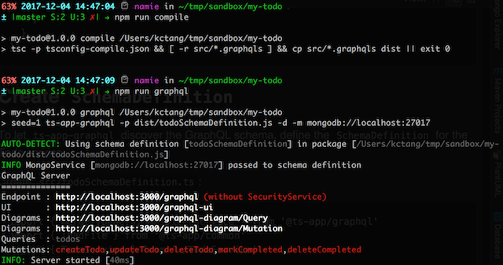
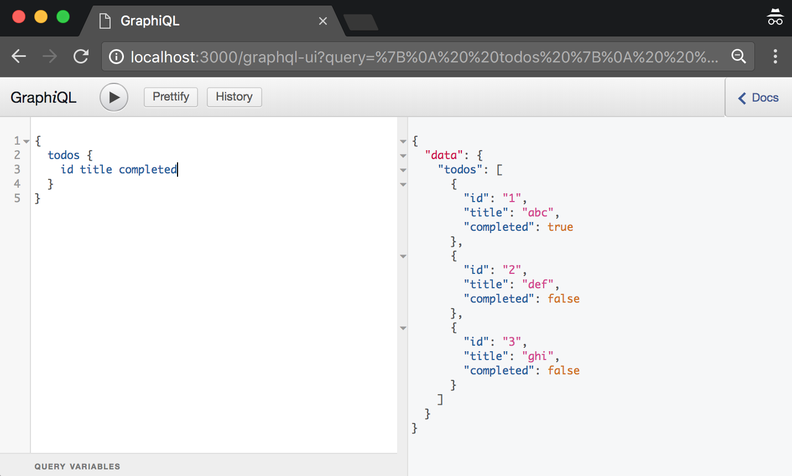
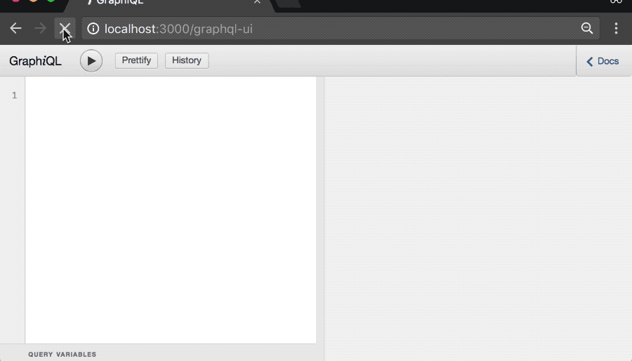

# @ts-app/graphql - Tutorial

If you have not done so, please read [README.md](https://github.com/ts-app/ts-app/blob/master/packages/graphql/README.md) first.

In this tutorial, we will:

* Configure a TypeScript project.
* Create a Todo service.
* Expose it as a GraphQL service.
* Learn to reuse schema definition.

Complete source code at [graphql-todo](https://github.com/ts-app/graphql-todo).

## Pre-requisites

* Basic [TypeScript](https://www.typescriptlang.org/index.html). It is a superset of JavaScript with static typing and compiles to standard JavaScript files before being executed.
* [GraphQL](http://graphql.org/) concepts. Highly recommended to at least go through the [GraphQL tutorial](http://graphql.org/graphql-js/).

## Project Files

This project consist of 3 production code files in `/src`, 1 test file and 5 configuration files for code linting, testing (with Jest) and `package.json` scripts for typical development workflow.

```
.
|____jest.config.js
|____package.json
|____src
| |____todo.graphqls
| |____todoSchemaDefinition.ts
| |____TodoService.ts
|____tests
| |______snapshots__
| | |____TodoService.test.ts.snap
| |____TodoService.test.ts
|____tsconfig-compile.json
|____tsconfig.json
|____tslint.json
```

It was structured to serve as a template for starting projects that use `@ts-app/graphql`.

Begin by creating a directory for the tutorial:
```
mkdir my-todo
cd my-todo
npm init -y

# add required dependencies
npm add -S @ts-app/server-bom @ts-app/graphql
```

If installed correctly, you should be able to run the following command:
```
$ ts-app-graphql --help
  Usage: ts-app-graphql [options]

  Options:

    -V, --version                       output the version number
    -l --list
    -p --package [packageName]
    -s --schema [schemaDefinitionName]
    -m --mongoUrl [mongoUrl]            Pass an instance of MongoService with specified MongoURL to SchemaDefinition (e.g. mongodb://localhost:27017)
    -r --rootType [rootType]            Diagram root type (e.g. Query, Mutation) Default: "Query".
    -d --develop                        Development mode
    -h, --help                          output usage information
```

Proceed to the next section if you can see this help message.

## Create TypeScript Project

We will now convert the NPM project to a TypeScript project with the following configuration:

* [Strict TypeScript compiler](https://blog.mariusschulz.com/2017/06/09/typescript-2-3-the-strict-compiler-option#strict-type-checking-options) checks via the `--strict` flag.
* Tests will be written with [Jest](https://facebook.github.io/jest/).
* [JavaScript Standard Style](https://github.com/standard/standard) for code linting.
* Write source codes in `src/`.
* Compile TypeScript to JavaScript files in `dist/`.
* Write Jest tests in `tests/` using the same filename as its counterpart in `src/`.
* Common development workflow tasks as scripts in `package.json`.

Run these commands:
```
# Initialize Git
git init

# Add required devDependencies
npm add -D @types/jest jest ts-jest
npm add -D tslint tslint-config-standard
npm add -D typescript
```

Let's create the configuration files.

### .gitignore
Git should ignore these files.
```
node_modules/
.idea/
dist/
```

### jest.config.js
Configure Jest to work with TypeScript via [ts-jest](https://github.com/kulshekhar/ts-jest). Enable source map generation and code coverage support.
```
module.exports = {
  "verbose": true,
  "transform": {
    ".(ts|tsx)": "<rootDir>/node_modules/ts-jest/preprocessor.js"
  },
  "testMatch": [
    "**/tests/**/*.test.ts?(x)"
  ],
  "coverageDirectory": "dist/coverage",
  "collectCoverageFrom": [
    "src/**/*.{ts,tsx,js,jsx}"
  ],
  "mapCoverage": true,
  "moduleFileExtensions": [
    "ts",
    "tsx",
    "js",
    "json"
  ],
  "globals": {
    "ts-jest": {
      "skipBabel": true,
      "tsConfigFile": "tsconfig.json"
    }
  },
  "testEnvironment": "node"
};
```

### package.json
Add scripts to manage development workflow.
```
  "scripts": {
    "clean": "rm -fr ./dist",
    "compile": "tsc -p tsconfig-compile.json && [ -r src/*.graphqls ] && cp src/*.graphqls dist || exit 0",
    "compile-watch": "tsc -p tsconfig-compile.json --watch",
    "coverage": "jest --maxWorkers=1 --coverage --collectCoverage",
    "graphql": "seed=1 ts-app-graphql -p dist/todoSchemaDefinition.js -d -m mongodb://localhost:27017",
    "lint": "tslint --project",
    "prepublishOnly": "npm run lint && npm run compile && npm run test",
    "test": "jest --maxWorkers=1",
    "test-watch": "jest --maxWorkers=1 --watch"
  }
```

The scripts:
* `clean` - Delete generated `./dist` directory.
* `compile` - Compile TypeScript files and copy `*.graphqls` to `./dist`.
* `compile-watch` - Compile and watch for changes to TypeScript files for recompilation. Note: This command will NOT watch for changes to `*.graphqls`.
* `coverage` - Generate code coverage report.
* `graphql` - Start GraphQL server with `dist/todoSchemaDefinition.js`.
* `lint` - Run code linter.
* `prepublishOnly` - Run linting, compile and tests before publishing a package.
* `test` - Run tests.
* `test-watch` - Run tests and watch for changes to re-run tests.

### tsconfig.json
Configure for [strong type safety](https://blog.mariusschulz.com/2017/06/09/typescript-2-3-the-strict-compiler-option), enable decorator.
```
{
  "compilerOptions": {
    "allowSyntheticDefaultImports": true,
    "declaration": true,
    "experimentalDecorators": true,
    "jsx": "react",
    "lib": [
      "dom",
      "es2016",
      "esnext.asynciterable"
    ],
    "module": "commonjs",
    "moduleResolution": "node",
    "pretty": true,
    "inlineSourceMap": true,
    "strict": true,
    "target": "es5"
  },
  "include": [
    "src/**/*",
    "tests/**/*"
  ]
}
```

If you are trying to prototype something quickly and find TypeScript too strict, you can temporarily set `strict` to `false`. Once you are done prototyping, set it to `true` and resolve all typing issues or potential bugs.

### tsconfig-compile.json
Used by `compile` and `compile-watch` scripts. It extends tsconfig.json configuration to generate JavaScript files to `/dist`.
```
{
  "extends": "./tsconfig",
  "compilerOptions": {
    "outDir": "dist"
  },
  "include": [
    "src/**/*"
  ]
}
```

### tslint.json
Let's not argue over how to format source code or usage of semicolons. Just use the [Standard JavaScript Style](https://standardjs.com/).
```
{
  "extends": "tslint-config-standard",
  "rules": {
    "no-unnecessary-type-assertion": false,
    "no-duplicate-imports": false
  }
}
```

Some extra rules added because I could not resolve some linting issues after updating dependencies recently. They were meant to be temporary, so feel free to remove them if possible.

## Write TodoService.todos()

Time to write some code. Create a `TodoService` that returns three fixed items and a unit test.

```typescript
// --- src/TodoService.ts
export type Todo = {
  id: string
  title: string
  completed: boolean
}

export class TodoService {
  async todos (): Promise<Todo[]> {
    return [
      { id: '1', title: 'abc', completed: true },
      { id: '2', title: 'def', completed: false },
      { id: '3', title: 'ghi', completed: false }
    ]
  }
}

// --- tests/TodoService.test.ts
import { TodoService } from '../src/TodoService'

describe('TodoService', () => {
  test('todos', async () => {
    const todo = new TodoService()
    const message = await todo.todos()
    expect(message).toMatchSnapshot()
  })
})
```

Let's run the tests with `npm test`:
```
$ npm test

> my-todo@1.0.0 test /xxx/my-todo
> jest --maxWorkers=1

 PASS  tests/TodoService.test.ts
  TodoService
    ✓ todos (8ms)

 › 1 snapshot written.
Snapshot Summary
 › 1 snapshot written in 1 test suite.

Test Suites: 1 passed, 1 total
Tests:       1 passed, 1 total
Snapshots:   1 added, 1 total
Time:        1.099s, estimated 2s
Ran all test suites.
```

If this works, then the TypeScript project is configured correctly.

## Expose todos() as a GraphQL Service

This involves 3 steps.

### 1. Create Type Definition

The type definition defines functionality provided by Todo service.

It will support:

- A single query type called `todos` that when executed, returns an array of `Todo` objects. The `Todo` type contains `id`, `title` and `completed` fields.
- Multiple mutation types (`createTodo`, `updateTodo`, `deleteTodo`, `markCompleted`, `deleteCompleted`) that we will deal with later.

Create `src/todo.graphqls`:
```
type Query {
    todos: [Todo]
}

type Mutation {
    createTodo(title: String!): NoPayload
    updateTodo(id: String!, title: String!): NoPayload
    deleteTodo(id: String!): NoPayload
    markCompleted(id: String!, completed: Boolean): NoPayload
    deleteCompleted: NoPayload
}

type Todo {
    id: String!
    title: String!
    completed: Boolean
}

type NoPayload {
    error: String
}
```

### 2. Decorate function with @Resolver()

Notice that the `todos` query type maps nicely to the `TodoService.todos()` TypeScript function. To make GraphQL call `todos()` function when users execute the `todos` GraphQL query, [decorate](https://www.typescriptlang.org/docs/handbook/decorators.html) the function:
```
import { Resolver } from '@ts-app/graphql'

export type Todo = {
  id: string
  title: string
  completed: boolean
}

export class TodoService {
  @Resolver() // <<< just add this
  async todos (): Promise<Todo[]> {
    return [
      { id: '1', title: 'abc', completed: true },
      { id: '2', title: 'def', completed: false },
      { id: '3', title: 'ghi', completed: false }
    ]
  }
}
```

### 3. SchemaDefinition

To run the Todo GraphQL service with `ts-app-graphql`, export a `SchemaDefinition` module.

Create `src/todoSchemaDefinition.ts`:
```typescript
import { mergeTypeDefs, ResolverService } from '@ts-app/graphql'
import { loadFile } from '@ts-app/common'
import { TodoService } from './TodoService'

export const todoSchemaDefinition = () => {
  const resolver = ResolverService.getInstance()

  const todoService = new TodoService()
  resolver.registerService(todoService)

  const typeDefs = mergeTypeDefs([ loadFile(`${__dirname}/todo.graphqls`) ])

  // create resolvers after all services with "@Resolver" are registered
  const resolvers = resolver.makeResolvers()

  return { resolvers, typeDefs }
}
```

This module returns type definitions and registered resolvers needed to create an executable GraphQL schema.

## Running Todo GraphQL Service

Compile and start the GraphQL server with these scripts from `package.json`:

- `npm run compile` - Compile `src/*.ts` and copy `src/*.graphqls` to the output directory (`/dist`)
- `npm run graphql` - Start GraphQL service with `ts-app-graphql`.

Todo service is now running at `http://localhost:3000/graphql`:

* Query/Mutation fields in red indicate that we have not implemented its resolver function.

* Try running this query from `http://localhost:3000/graphql-ui`. It should return the three hard coded Todo entries:



## Write TodoService.ts Functions/Resolvers

Let's write the entire `TodoService.ts` class. It is a simple "in-memory" implementation.

Replace `src/TodoService.ts` with this:
```typescript
import * as crypto from 'crypto'
import { Resolver } from '@ts-app/graphql'

const uuid = () => crypto.randomBytes(16).toString('hex')

export type Todo = {
  id: string
  title: string
  completed: boolean
  createdAt: Date
}

export class TodoService {
  _todos: {
    [key: string]: Todo
  } = {}

  @Resolver()
  async todos (): Promise<Todo[]> {
    return Object.keys(this._todos).map(id => this._todos[ id ])
  }

  @Resolver({ type: 'mutation', paramNames: [ 'title' ] })
  createTodo (title: string) {
    const id = uuid()
    this._todos[ id ] = {
      id, title,
      completed: false,
      createdAt: new Date()
    }
  }

  @Resolver({ type: 'mutation' })
  updateTodo ({ id, title }: { id: string, title: string }) {
    const todo = this._todos[ id ]
    if (!todo) {
      return { error: `Todo [${id}] not found` }
    }

    todo.title = title
  }

  @Resolver({ type: 'mutation', paramNames: [ 'id' ] })
  deleteTodo (id: string) {
    delete this._todos[ id ]
  }

  @Resolver({ type: 'mutation' })
  markCompleted ({ id, completed }: { id: string, completed: boolean }) {
    console.log(completed)
    const todo = this._todos[ id ]
    if (!todo) {
      return { error: `Todo [${id}] not found` }
    }

    todo.completed = completed
  }

  @Resolver({ type: 'mutation' })
  deleteCompleted () {
    throw new Error('Not implemented!')
  }
}
```

With this change, we will need to update the test codes for `tests/TodoService.test.ts`:
```typescript
import { TodoService } from '../src/TodoService'

describe('TodoService', () => {
  test('todos() is empty', async () => {
    const todo = new TodoService()
    const message = await todo.todos()
    expect(message).toEqual([])
  })

  test('create() 1 todo', async () => {
    const todo = new TodoService()
    todo.createTodo('bob')
    todo.createTodo('candy')
    const title = (await todo.todos()).map(todo => todo.title)
    expect(title).toEqual([ 'bob', 'candy' ])
  })
})
```

Compile and restart the Todo GraphQL service. You can use all the functions provided by Todo service.

## Screencast - Demo
This Todo GraphQL service demo starts with an empty todo list, create a few todos, refresh the todos(), update a title and mark a todo as completed. Observe that payload for `todos` query reflects changes made by the mutations.



## Reusing SchemaDefinition

In this section, we will reuse a schema definition provided by the `@ts-app/graphql` package in the Todo schema definition.

In `src/TodoService.ts`, it supports a `createdAt` Date:
```
export type Todo = {
  id: string
  title: string
  completed: boolean
  createdAt: Date
}
```

However, it is not yet defined in the `src/todo.graphqls` type definition:
```
type Todo {
    id: String!
    title: String!
    completed: Boolean
}
```

To fix this, change `type Todo` in `src/todo.graphqls` to:
```
type Todo {
    id: String!
    title: String!
    completed: Boolean
    createdAt: Date
}
```

We just used a [custom scalar type](http://graphql.org/learn/schema/) in our schema definition because `Date` is not supported out of the box by GraphQL.

For this to work, we need to:

1. Declare the `scalar Date` type.
2. Implement the `Date` resolver.

This is what `standardSchemaDefinition` provides. So, we just need to update `src/todoSchemaDefinition.ts` to depend on this:
```typescript
import {
  mergeTypeDefs, ResolverService, SchemaDefinition,
  standardSchemaDefinition
} from '@ts-app/graphql'
import { loadFile } from '@ts-app/common'
import { TodoService } from './TodoService'

export const todoSchemaDefinition = (): SchemaDefinition => {
  const resolver = ResolverService.getInstance()

  const standard = standardSchemaDefinition()

  const todoService = new TodoService()
  resolver.registerService(todoService)

  const typeDefs = mergeTypeDefs([ loadFile(`${__dirname}/todo.graphqls`) ])
  // create resolvers after all services with "@Resolver" are registered
  const resolvers = resolver.makeResolvers()

  return {
    resolvers, typeDefs,
    dependencies: {
      standard
    }
  }
}
```

Now recompile and restart the GraphQL service and `createdAt` will be supported.

This demonstrates how schema definitions can be reused.

## Next Step

Securing GraphQL service with [@ts-app/security](https://github.com/ts-app/ts-app/tree/master/packages/security).

This will be covered the security package's tutorial.
